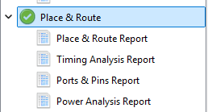

# Relatório Técnico - DR1 TP2 (Verilog/FPGA)

Aluno: Renato Noronha Hack  
Disciplina: Sistemas Embarcados / Verilog FPGA  
Placa-alvo: Tang Nano 9K (GW1NR-LV9QN88PC6/I5)  
Ferramenta: Gowin EDA V1.9.12.01 (64-bit)

## 1) Níveis lógicos e sinais digitais

Em FPGA, o valor lógico (`0` ou `1`) é representado por uma faixa de tensão elétrica em cada pino de I/O.  
Neste projeto na Tang Nano 9K foram usados dois padrões de I/O:

- `LVCMOS18` (LEDs e botões onboard): `0` próximo de 0 V e `1` próximo de 1,8 V
- `LVCMOS33` (duas entradas extras em pinos de expansão): `0` próximo de 0 V e `1` próximo de 3,3 V

Na prática, a FPGA não interpreta apenas valores exatos (como 0,000 V, 1,800 V ou 3,300 V), e sim faixas válidas para `LOW` e `HIGH` definidas pelo padrão elétrico do banco.

## 2) Convenção lógica adotada

Convenção usada no TP:

- Switch pressionado -> `1` lógico
- Switch solto -> `0` lógico
- LED aceso -> `1` lógico
- LED apagado -> `0` lógico

Tabela de convenção:

| Sinal | Estado físico | Valor lógico |
|---|---|---|
| SW1 | pressionado / solto | 1 / 0 |
| SW2 | pressionado / solto | 1 / 0 |
| SW3 | pressionado / solto | 1 / 0 |
| SW4 | pressionado / solto | 1 / 0 |
| LED1 | aceso / apagado | 1 / 0 |
| LED2 | aceso / apagado | 1 / 0 |
| LED3 | aceso / apagado | 1 / 0 |
| LED4 | aceso / apagado | 1 / 0 |

Observação de hardware (Tang Nano 9K): os LEDs onboard e os botões onboard são ativos em nível baixo. Nesta entrega, a convenção lógica do enunciado foi mantida na simulação e no relatório (`ativo = 1`).

## 3) Criação do projeto no Gowin IDE

Projeto criado:

- Nome do projeto: `tp2_tang_nano_9k`
- Dispositivo selecionado: `GW1NR-LV9QN88PC6/I5`

Estrutura inicial de arquivos/pastas (padrão da IDE):

- `tp2_tang_nano_9k.gprj`
- `src/` (fontes do usuário)
- `impl/` (arquivos gerados de síntese e PnR)

## 4) Criação do arquivo top.v no assistente da IDE

Passos executados na IDE:

1. `File > New File...`
2. Selecionar `Verilog File`
3. Nomear como `top.v`
4. Manter `Add to current project`
5. Confirmar em `OK`

## 5) Módulo Top com interface exigida

Interface implementada em `top.v`:

Entradas:

- `i_Switch_1`
- `i_Switch_2`
- `i_Switch_3`
- `i_Switch_4`

Saídas:

- `o_LED_1`
- `o_LED_2`
- `o_LED_3`
- `o_LED_4`

## 6) Wiring direto por continuous assignment

Ligações diretas implementadas na etapa de wiring:

- `o_LED_1 = i_Switch_1`
- `o_LED_2 = i_Switch_2`
- `o_LED_3 = i_Switch_3`
- `o_LED_4 = i_Switch_4`

Observação de evolução do projeto:

Na etapa seguinte (integração do `Logic_Block`), `o_LED_1` foi redirecionado para `F`, conforme exigido no Item 8.

Explicação (até 5 linhas):

Em Verilog concorrente, `assign` descreve conexões de hardware ativas em paralelo, não uma sequência de instruções como em software. Cada atribuição vira lógica combinacional/fio interno no netlist da FPGA. Assim, mudando a entrada, a saída correspondente muda automaticamente conforme o atraso de propagação do circuito.

## 7) Módulo combinacional Logic_Block

Arquivo `logic_block.v` criado com:

- Entradas: `A`, `B`, `C`
- Saída: `F`
- Função: `F = (A & B) | (~C)`
- Implementação somente com operadores combinacionais e `assign`

## 8) Integração do Logic_Block ao Top

Conexões implementadas:

- `A = i_Switch_1`
- `B = i_Switch_2`
- `C = i_Switch_3`
- `o_LED_1 = F`

LED mantido em conexão direta com switch:

- `o_LED_4 = i_Switch_4`

## 9) Testbench funcional (6 combinações exigidas)

Arquivo de teste: `top_tb.v`

Combinações aplicadas (na ordem do enunciado):

1. `0000`
2. `0101`
3. `1010`
4. `1100`
5. `1110`
6. `1001`

## 10) Tabela de simulação funcional

Lógica implementada no Top:

- `LED1 = (SW1 & SW2) | (~SW3)`
- `LED2 = SW2`
- `LED3 = SW3`
- `LED4 = SW4`

Tabela de resultados:

| Caso | SW1 | SW2 | SW3 | SW4 | LED1 | LED2 | LED3 | LED4 |
|---|---:|---:|---:|---:|---:|---:|---:|---:|
| 1 | 0 | 0 | 0 | 0 | 1 | 0 | 0 | 0 |
| 2 | 0 | 1 | 0 | 1 | 1 | 1 | 0 | 1 |
| 3 | 1 | 0 | 1 | 0 | 0 | 0 | 1 | 0 |
| 4 | 1 | 1 | 0 | 0 | 1 | 1 | 0 | 0 |
| 5 | 1 | 1 | 1 | 0 | 1 | 1 | 1 | 0 |
| 6 | 1 | 0 | 0 | 1 | 1 | 0 | 0 | 1 |

Conclusão da simulação:

- O comportamento observado corresponde ao esperado com base na lógica implementada.

Evidência de simulação:

- Log da simulação: `evidencias/dsim.log`

## 11) Constraints, síntese e place & route

Arquivo de constraints: `constraints.cst`

Tabela "Sinal lógico -> Pino físico":

| Sinal lógico | Pino físico |
|---|---:|
| i_Switch_1 | 3 |
| i_Switch_2 | 4 |
| i_Switch_3 | 17 |
| i_Switch_4 | 18 |
| o_LED_1 | 10 |
| o_LED_2 | 11 |
| o_LED_3 | 13 |
| o_LED_4 | 14 |

Observação: na Tang Nano 9K, os pinos de LED foram mapeados para LEDs onboard oficiais (10, 11, 13, 14), enquanto `i_Switch_1` e `i_Switch_2` usam botões onboard (3, 4). Como a placa não possui 4 switches onboard, `i_Switch_3` e `i_Switch_4` foram mapeados para pinos de expansão (17, 18).

Status do fluxo:

- `Synthesize` executado com sucesso no Gowin IDE
- `Place & Route` executado com sucesso no Gowin IDE

Evidência de síntese:

Evidência de place & route:

## 12) Programação na placa (Download to SRAM) e validação física

Como o ambiente informado não possui hardware disponível (sem acesso a switches/LEDs físicos), esta etapa fica registrada como **não executada** neste TP por limitação de bancada.

Para execução futura, usar no Gowin Programmer:

- Operação: `Download to SRAM`
- Executar os 6 casos da tabela de simulação
- Registrar foto/vídeo da placa para cada caso

Observação para teste físico na 9K: como recursos onboard são ativos em nível baixo, será necessário considerar a polaridade inversa na interpretação ou ajustar o código para inversão na camada de I/O.

Conclusão esperada quando houver hardware:

- O comportamento físico deve reproduzir a tabela de simulação funcional.

## 13) Arquivos entregues

- `tp2_tang_nano_9k/tp2_tang_nano_9k.gprj`
- `tp2_tang_nano_9k/src/top.v`
- `tp2_tang_nano_9k/src/logic_block.v`
- `tp2_tang_nano_9k/src/top_tb.v`
- `tp2_tang_nano_9k/src/constraints.cst`
- `tp2_tang_nano_9k/impl/gwsynthesis/*`
- `tp2_tang_nano_9k/impl/pnr/*`
- `tp2_arquivos/relatorio_tecnico_tp2.md`
- `tp2_arquivos/evidencias/dsim.log`
- `tp2_arquivos/evidencias/sintese.png`
- `tp2_arquivos/evidencias/pnr.png`

## 14) Referências técnicas

- Gowin Software User Guide (SUG100): https://cdn.gowinsemi.com.cn/SUG100E.pdf
- Gowin Software Quick Start Guide (SUG918): https://cdn.gowinsemi.com.cn/SUG918E.pdf
- Tang Nano 9K wiki oficial: https://wiki.sipeed.com/hardware/en/tang/Tang-Nano-9K/Nano-9K.html
