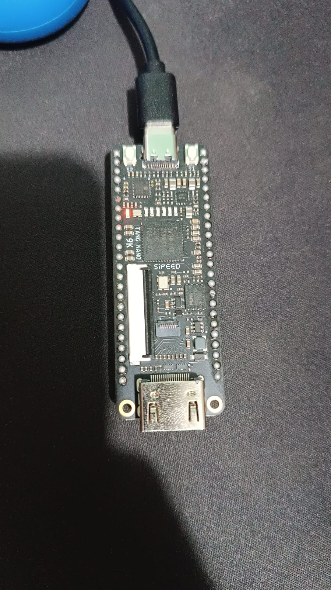
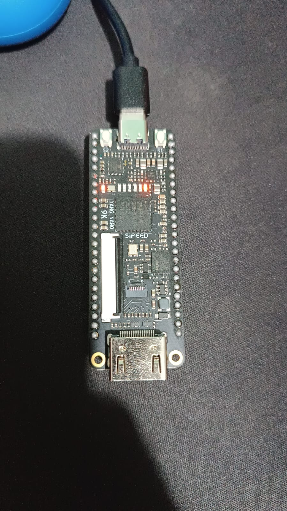
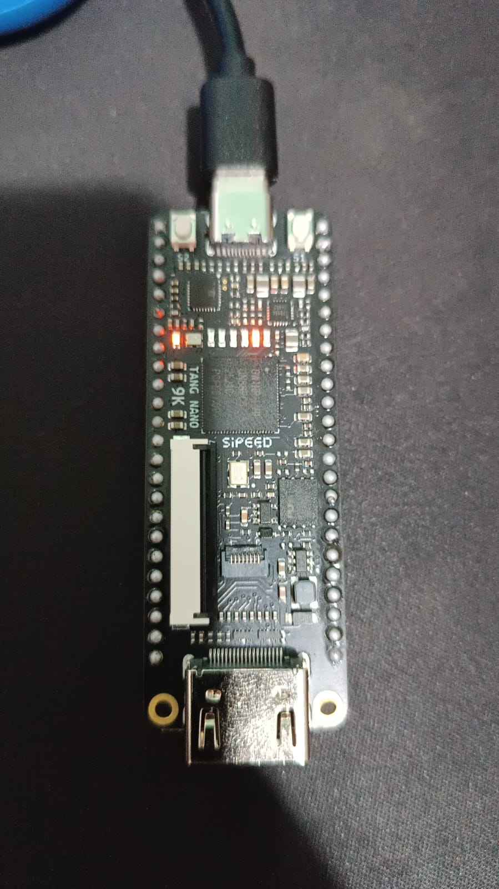
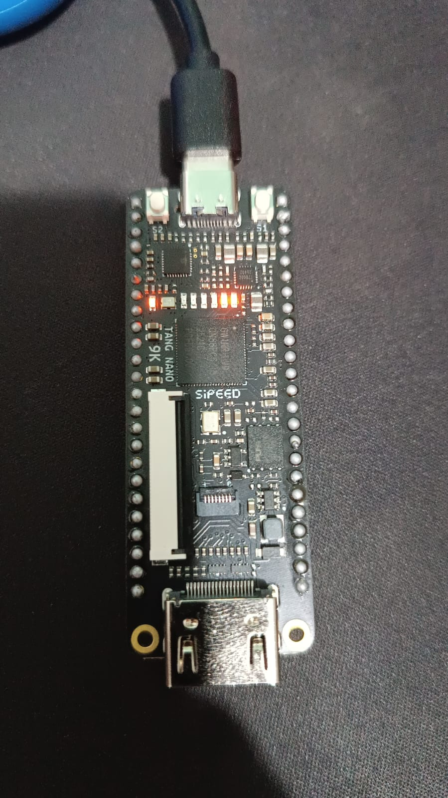

# Relatorio Tecnico - DR1 TP3

## 1. Identificacao
- Nome completo: Renato Noronha Hack
- Disciplina: Fundamentos de Verilog e FPGA
- Professor: Vitor Amadeu
- Data: 14/03/2026

## 2. Etapa 1 - Funcao booleana e fundamentos

### Item 1 - Interpretacao da funcao
Funcao fornecida:
- F(A,B,C) = Sm(1,3,5,7)

Combinacoes de entrada que tornam F = 1:
- 001, 011, 101, 111

Interpretacao logica (em palavras):
- A saida F vale 1 em todos os casos em que C=1.
- As variaveis A e B nao alteram o resultado nesses casos.
- Portanto, a funcao depende apenas de C.

## 3. Etapa 1 - Tabela verdade (Item 2)

| Decimal | A | B | C | F | Produto Fundamental |
|---|---|---|---|---|---|
| 0 | 0 | 0 | 0 | 0 | A'B'C' |
| 1 | 0 | 0 | 1 | 1 | A'B'C |
| 2 | 0 | 1 | 0 | 0 | A'BC' |
| 3 | 0 | 1 | 1 | 1 | A'BC |
| 4 | 1 | 0 | 0 | 0 | AB'C' |
| 5 | 1 | 0 | 1 | 1 | AB'C |
| 6 | 1 | 1 | 0 | 0 | ABC' |
| 7 | 1 | 1 | 1 | 1 | ABC |

Consistencia da tabela com a definicao do enunciado:
- A tabela esta consistente com Sm(1,3,5,7), pois F=1 exatamente nesses mintermos.

## 4. Etapa 2 - Formas canonicas

### Item 3 - Forma SOP (Soma de Produtos)
Expressao SOP canonica:

```text
F = A'B'C + A'BC + AB'C + ABC
```

### Item 4 - Forma POS (Produto de Somas)
Expressao POS canonica:

```text
F = (A + B + C)(A + B' + C)(A' + B + C)(A' + B' + C)
```

## 5. Etapa 3 - Mapa de Karnaugh e minimizacao

### Item 5 - Mapa de Karnaugh

| AB \\ C | C' | C |
|---|---|---|
| A'B' | 0 | 1 |
| A'B  | 0 | 1 |
| AB   | 0 | 1 |
| AB'  | 0 | 1 |

Agrupamentos identificados:
- Grupo 1: coluna inteira C (4 celulas com valor 1)
- Grupo 2: nao necessario

### Item 6 - Expressao minimizada
Expressao minimizada:

```text
F = C
```

Comparacao de complexidade (antes/depois):
- Termos na forma canonica SOP: 4 termos de 3 variaveis
- Termos na forma minimizada: 1 termo de 1 variavel
- Conclusao: houve reducao significativa de complexidade logica.

## 6. Etapa 4 - Implementacao combinacional em Verilog

### Item 7 - Arquivo comb_logic.v

```verilog
module Comb_Logic (
    input  wire A,
    input  wire B,
    input  wire C,
    output wire F
);
    assign F = C;
endmodule
```

### Item 8 - Testbench e resultados (entradas -> saida observada)
Tabela de observacao da simulacao:

| A | B | C | F_observado |
|---|---|---|---|
| 0 | 0 | 0 | 0 |
| 0 | 0 | 1 | 1 |
| 0 | 1 | 0 | 0 |
| 0 | 1 | 1 | 1 |
| 1 | 0 | 0 | 0 |
| 1 | 0 | 1 | 1 |
| 1 | 1 | 0 | 0 |
| 1 | 1 | 1 | 1 |

Conclusao da verificacao:
- A simulacao confirma F=C para todas as 8 combinacoes de entrada.

## 7. Etapa 5 - Mux2to1
- Codigo fonte: `src/mux2to1.v`

## 8. Etapa 6 - Reg1 e Counter2bit

### Item 10 - Reg1
Papel do flip-flop no armazenamento de estado:
- O flip-flop D e o elemento sequencial responsavel por armazenar 1 bit de informacao.
- A cada borda de subida do clock, ele copia o valor presente em `D` para a saida `Q`.
- Dessa forma, o circuito passa a ter memoria, pois o valor de `Q` permanece armazenado ate a proxima borda de clock.
- No modulo `Reg1`, o reset sincrono ativo em nivel alto permite forcar `Q=0` em uma borda de subida, reinicializando o estado do circuito de forma controlada.

### Item 11 - Counter2bit
Sequencia observada do contador:
- 00 -> 01 -> 10 -> 11 -> 00

## 9. Etapa 7 - Integracao no top e validacao fisica

### Item 12
- Mapeamento de pinos: clk=52, btn_inc_n=3, led0=10, led1=11
- Montagem fisica: uso apenas da Tang Nano 9K, sem protoboard, com botao e LEDs onboard
- Resultado na placa Tang Nano 9K: contador iniciou em 00 e incrementou para 01, 10, 11 e 00 a cada apertar e soltar do botao onboard
- Evidencia (foto/video):









## 10. Conclusao
- O desenvolvimento deste trabalho permitiu revisar todo o fluxo basico de projeto em FPGA, partindo da definicao de uma funcao booleana, passando pela minimizacao com mapa de Karnaugh e chegando a implementacao em Verilog.
- Na parte combinacional, foi confirmado por simulacao que a expressao minimizada da funcao proposta e simplesmente `F = C`.
- Na parte sequencial, o uso do flip-flop D mostrou como o FPGA pode armazenar estado e, a partir disso, implementar um contador binario de 2 bits.
- A validacao final na Tang Nano 9K confirmou o funcionamento pratico do sistema, com o contador avancando corretamente e os LEDs representando visualmente os estados `00`, `01`, `10` e `11`.

## 11. Anexos
- Capturas de simulacao
- Captura do mapa de Karnaugh
- Fotos da placa em funcionamento: `00.png`, `01.png`, `10.png`, `11.png`
