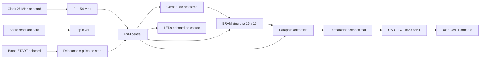
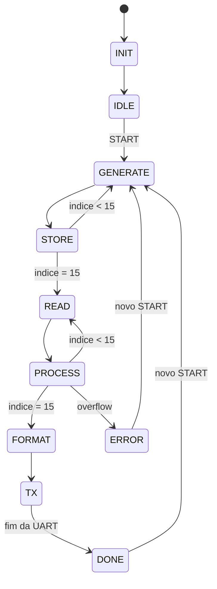
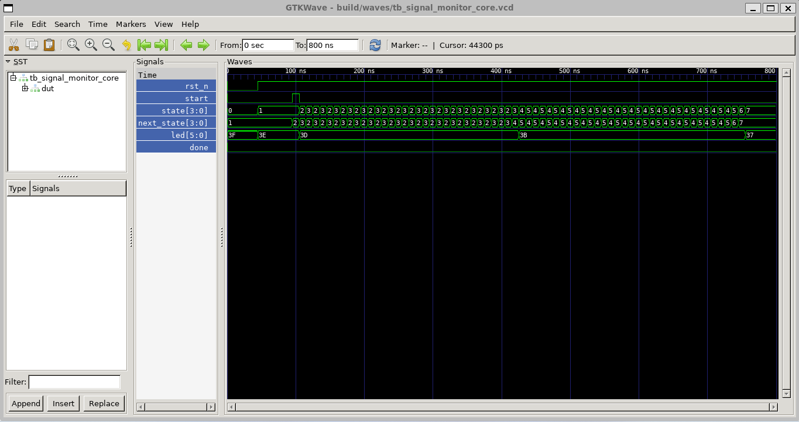
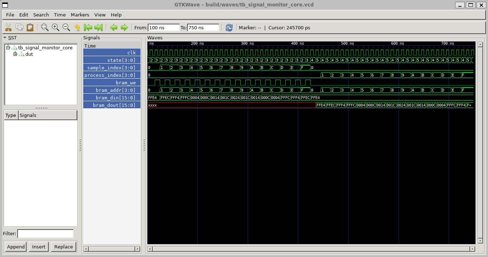
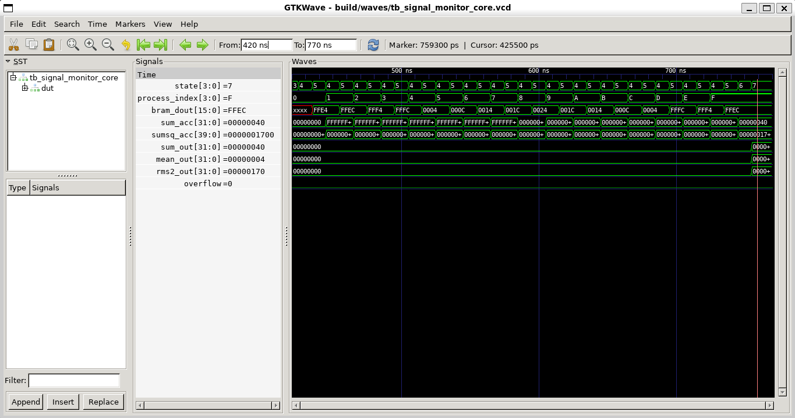
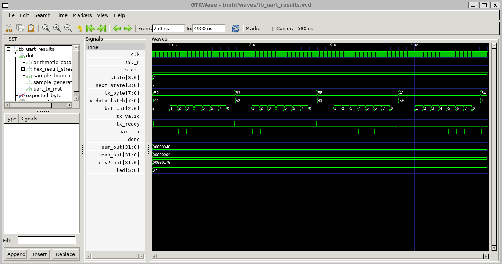
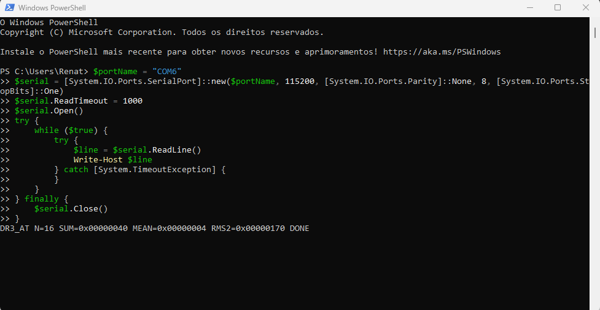

# Relatorio Tecnico - DR3 AT

## 1. Visao geral

Este projeto implementa um sistema digital de monitoramento de sinal discreto para a FPGA Tang Nano 9K. O sistema gera 16 amostras digitais signed de 16 bits, armazena essas amostras em BRAM interna, calcula metricas aritmeticas e transmite os resultados por UART.

A versao implementada usa somente recursos onboard da placa:

- Botao START: botao onboard ligado a `start_n`.
- Reset: botao onboard ligado a `rst_n`.
- LEDs de estado: 6 LEDs onboard, ativos em nivel baixo.
- Saida digital: UART TX onboard via USB-UART/BL702.
- Protoboard: nao necessaria para a implementacao padrao.

## 2. Metricas calculadas

O vetor tipico gerado pelo sensor interno e:

```text
[-28, -20, -12, -4, 4, 12, 20, 28, 36, 28, 20, 12, 4, -4, -12, -20]
```

As metricas sao:

```text
S = sum(x_i)
media = S / 16
RMS2 = sum(x_i * x_i) / 16
```

Resultados esperados:

| Metrica | Decimal | Hexadecimal |
| --- | ---: | --- |
| Soma acumulada | 64 | `0x00000040` |
| Media | 4 | `0x00000004` |
| Soma dos quadrados | 5888 | `0x00001700` |
| RMS simplificado | 368 | `0x00000170` |

Mensagem UART esperada:

```text
DR3_AT N=16 SUM=0x00000040 MEAN=0x00000004 RMS2=0x00000170 DONE
```

## 3. Arquitetura



Blocos principais:

- `signal_monitor_top.v`: integra PLL, debounce do botao e core.
- `signal_monitor_core.v`: FSM central, BRAM, datapath, formatador e UART.
- `sample_generator.v`: gera as 16 amostras signed.
- `sample_bram.v`: memoria sincrona com inferencia de BRAM.
- `arithmetic_datapath.v`: soma, media e RMS simplificado.
- `hex_result_stream.v`: formata os resultados em ASCII hexadecimal.
- `uart_tx.v`: transmissor UART 8N1.
- `pll_54mhz.v`: wrapper da PLL Gowin e modelo comportamental para simulacao.

## 4. FSM de controle



Tabela de estados:

| Estado | Funcao |
| --- | --- |
| `INIT` | Limpa datapath e prepara o sistema. |
| `IDLE` | Aguarda pulso de START. |
| `GENERATE` | Seleciona a amostra do sensor interno. |
| `STORE` | Escreve a amostra na BRAM. |
| `READ` | Aplica o endereco de leitura sincrona da BRAM. |
| `PROCESS` | Acumula soma e quadrado da amostra lida. |
| `FORMAT` | Registra soma, media e RMS simplificado finais. |
| `TX` | Transmite a mensagem ASCII pela UART. |
| `DONE` | Indica fim do processamento nos LEDs. |
| `ERROR` | Indica erro/overflow. |

A implementacao em `signal_monitor_core.v` separa explicitamente:

- Registrador de estado.
- Logica combinacional de proximo estado.
- Logica combinacional de saidas da FSM.
- Registradores auxiliares de indices e controle da transmissao.

## 5. BRAM, DSP e PLL

BRAM:

- Implementada em `sample_bram.v`.
- Acesso sincrono, controlado pela FSM.
- Profundidade de 16 posicoes e largura de 16 bits.
- Anotacao de sintese: `syn_ramstyle = "block_ram"`.

DSP:

- O quadrado `sample_in * sample_in` fica em `arithmetic_datapath.v`.
- A multiplicacao signed 16 x 16 e anotada com `syn_dspstyle = "dsp"`.
- Apos sintetizar no Gowin, verificar no relatorio de utilizacao se houve inferencia de multiplicador/DSP.

PLL:

- Entrada: clock onboard de 27 MHz.
- Saida planejada: clock derivado de 54 MHz.
- Em simulacao, `pll_54mhz.v` usa modelo comportamental com `pll_locked`.
- Em sintese, o mesmo arquivo instancia o primitivo `rPLL` da Gowin.

## 6. Comunicacao digital

A saida digital e UART TX, 115200 baud, 8 bits, sem paridade, 1 stop bit. A UART usa o pino onboard conectado ao conversor USB-UART da Tang Nano 9K, entao a validacao em hardware pode ser feita com um terminal serial.

Pinos usados:

| Sinal | Pino FPGA |
| --- | ---: |
| `clk` | 52 |
| `rst_n` | 4 |
| `start_n` | 3 |
| `uart_tx` | 17 |
| `led[0]` | 10 |
| `led[1]` | 11 |
| `led[2]` | 13 |
| `led[3]` | 14 |
| `led[4]` | 15 |
| `led[5]` | 16 |

## 7. Simulacao e testes

Comando principal:

```bash
make sim
```

Testbenches:

| Testbench | O que verifica |
| --- | --- |
| `tb_signal_monitor_core.v` | Fluxo completo tipico e metricas finais. |
| `tb_extreme_metrics.v` | Vetor tipico, maximos, minimos e alternado extremo. |
| `tb_bram.v` | Escrita/leitura sincrona da BRAM. |
| `tb_uart_results.v` | Decodificacao serial da mensagem UART. |
| `tb_pll_54mhz.v` | Modelo de simulacao da PLL e sinal de lock. |
| `tb_button_debounce.v` | Debounce e geracao de um unico pulso START. |

Resultado obtido localmente:

```text
PASS: core typical flow produced SUM=64 MEAN=4 RMS2=368
PASS: datapath typical, extreme and alternating cases
PASS: synchronous BRAM write/read
PASS: UART transmitted expected metrics string
PASS: pll simulation model locked and generated derived clock
PASS: debounce generated one start pulse
```

## 8. Interpretacao das formas de onda

Inserir os prints gerados pelo GTKWave:



Neste print, destacar a sequencia de estados desde `INIT` ate `DONE`, mostrando que a FSM passa por geracao, armazenamento, leitura, processamento e transmissao.



Neste print, destacar `bram_we` ativo no estado `STORE`, os enderecos de 0 a 15 e a leitura sincrona no estado `READ`.



Neste print, destacar os valores finais `sum_out=64`, `mean_out=4` e `rms2_out=368`.



Neste print, destacar `tx_valid`, `tx_ready`, `tx_byte` e `uart_tx`, mostrando a transmissao ASCII da mensagem final.

## 9. Validacao em hardware

Inserir as evidencias:




Procedimento:

1. Abrir o projeto `dr3_at.gprj` no Gowin EDA.
2. Confirmar o top level `signal_monitor_top`.
3. Confirmar que `constraints/tangnano9k.cst` e `constraints/tangnano9k.sdc` estao habilitados.
4. Sintetizar, implementar e programar a Tang Nano 9K.
5. No Windows, abrir terminal serial em 115200 8N1 na porta COM da Tang Nano 9K.
6. Pressionar START.
7. Conferir LEDs e mensagem UART.
8. Registrar fotos e prints com os nomes indicados.

## 10. Justificativas de projeto

- A UART onboard elimina a necessidade de protoboard sem remover a interface digital exigida.
- Os LEDs onboard sao suficientes para indicar estados da FSM.
- A BRAM e pequena, mas a implementacao foi escrita para inferir memoria interna e demonstrar acesso sincrono.
- O RMS simplificado evita raiz quadrada, conforme especificado no enunciado, e usa multiplicacao adequada para inferencia de DSP.
- O START passa por debounce para evitar multiplas execucoes causadas pelo botao fisico.

## 11. Referencias

- Sipeed Tang Nano 9K Wiki: https://wiki.sipeed.com/hardware/en/tang/Tang-Nano-9K/Nano-9K.html
- Exemplos oficiais Sipeed TangNano-9K-example: https://github.com/sipeed/TangNano-9K-example
- Documentacao Gowin de sintese e primitivas PLL/DSP/BRAM.
