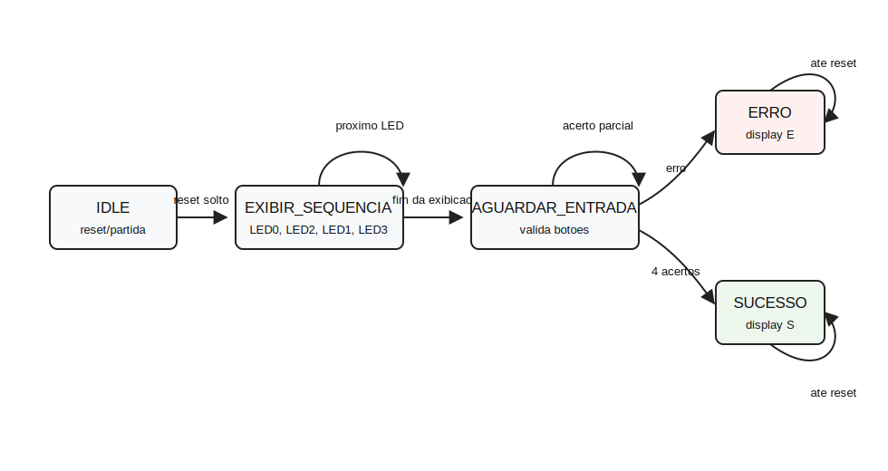

# Relatório Técnico - DR3 TP1

Aluno: Renato Noronha Hack  
Disciplina: Verilog Avançado e Arquiteturas FPGA  
Projeto: Sistema de Validação de Sequência Operacional  
Placa: Tang Nano 9K  

Este Markdown é a versão textual do relatório. A versão final diagramada foi gerada em `relatorio/relatorio_DR3_TP1.pdf` a partir de `relatorio/relatorio_DR3_TP1.html`.

## Resumo

O projeto implementa uma FSM em Verilog HDL para validar uma sequência fixa de quatro entradas. A Tang Nano 9K exibe a sequência nos LEDs onboard, aguarda a reprodução por botões externos e informa progresso, erro ou sucesso em um display HS-5101AG cátodo comum.

Sequência validada:

| Etapa | LED ativo | Entrada esperada |
| ---: | --- | --- |
| 1 | LED0 | Botão 0 |
| 2 | LED2 | Botão 2 |
| 3 | LED1 | Botão 1 |
| 4 | LED3 | Botão 3 |

Indicações no display:

| Momento | Indicação |
| --- | --- |
| Exibição dos LEDs | 1, 2, 3 e 4 |
| Aguardando entrada | 0 e progresso |
| Sequência correta | S, visualmente parecido com 5 |
| Entrada incorreta | E |

## FSM

A FSM possui os estados `IDLE`, `EXIBIR_SEQUENCIA`, `AGUARDAR_ENTRADA`, `ERRO` e `SUCESSO`. Após `ERRO` ou `SUCESSO`, o sistema permanece travado até novo reset.



## Arquitetura

| Módulo | Função |
| --- | --- |
| `sequence_validator_top` | Integra clock, reset, botões, FSM, LEDs e display. |
| `sequence_fsm` | Controla estados, temporização, validação e sinais finais. |
| `button_conditioner` | Sincroniza botões, aplica debounce e gera pulso único. |
| `seven_segment_decoder` | Codifica progresso, erro e sucesso nos segmentos A-G. |

## Mapeamento da Tang Nano 9K

| Sinal | Pino |
| --- | ---: |
| `sys_clk` | 52 |
| `sys_rst_n` | 4 |
| `led_n[0]` | 10 |
| `led_n[1]` | 11 |
| `led_n[2]` | 13 |
| `led_n[3]` | 14 |
| `btn_n[0]` | 25 |
| `btn_n[1]` | 26 |
| `btn_n[2]` | 27 |
| `btn_n[3]` | 28 |
| `seg_a` | 29 |
| `seg_b` | 30 |
| `seg_c` | 33 |
| `seg_d` | 34 |
| `seg_e` | 40 |
| `seg_f` | 41 |
| `seg_g` | 37 |

## Ligações do Protoboard

Display:

| Função | Protoboard |
| --- | --- |
| DP, sem conexão | `g1` |
| C | `g2` |
| COM/GND | `g3` |
| D | `g4` |
| E | `g5` |
| B | `c1` |
| A | `c2` |
| COM/GND | `c3` |
| F | `c4` |
| G | `c5` |

Jumpers Tang para protoboard:

| Sinal | Pino Tang | Protoboard |
| --- | ---: | --- |
| Botão 0 | 25 | `a30` |
| Botão 1 | 26 | `a25` |
| Botão 2 | 27 | `a20` |
| Botão 3 | 28 | `a15` |
| Segmento A | 29 | `e8` |
| Segmento B | 30 | `e9` |
| Segmento C | 33 | `g8` |
| Segmento D | 34 | `g7` |
| Segmento E | 40 | `g6` |
| Segmento F | 41 | `e7` |
| Segmento G | 37 | `e6` |
| GND | GND | trilha `-` |

Resistores de 330 ohms:

| Resistor | Par no protoboard | Segmento |
| --- | --- | --- |
| R_A | `a2 - a8` | A |
| R_B | `a1 - a9` | B |
| R_C | `j2 - j8` | C |
| R_D | `j4 - j7` | D |
| R_E | `j5 - j6` | E |
| R_F | `a4 - a7` | F |
| R_G | `a5 - a6` | G |

GND no protoboard:

| Par | Função |
| --- | --- |
| `j28 - -28` | GND do botão físico 1 |
| `j23 - -23` | GND do botão físico 2 |
| `j18 - -18` | GND do botão físico 3 |
| `j13 - -13` | GND do botão físico 4 |
| `j3 - -3` | Comum inferior do display |
| `a3 - -3` | Comum superior do display |

## Verificação

O testbench `sim/tb_sequence_validator.v` cobre exibição da sequência, caminho de sucesso, erros no início/meio, botões simultâneos e reinício por reset.

Resultado da simulação:

```text
ALL TESTS PASSED
```

Evidências usadas no relatório:

| Evidência | Arquivo |
| --- | --- |
| Waveform | `evidencias/simulacao_waveform.png` |
| Síntese e Place&Route | `evidencias/synth_pnr_ok.png` |
| Placa após reset | `evidencias/tang_reset_idle.jpg` |
| Sequência de LEDs | `evidencias/tang_exibindo_sequencia.jpg` |
| Sucesso | `evidencias/tang_sucesso.jpg` |
| Erro | `evidencias/tang_erro.jpg` |

Vídeo demonstrativo:

https://drive.google.com/file/d/1luIPP85dv7LsXDyn4a8KNa89JMeU_e3M/view?usp=drive_link

## Conclusão

O sistema atende à especificação do TP1. A FSM apresenta a sequência fixa, valida as entradas, detecta erros imediatamente e sinaliza os estados finais no display. A solução foi validada por simulação, síntese/Place&Route e funcionamento físico na Tang Nano 9K.
